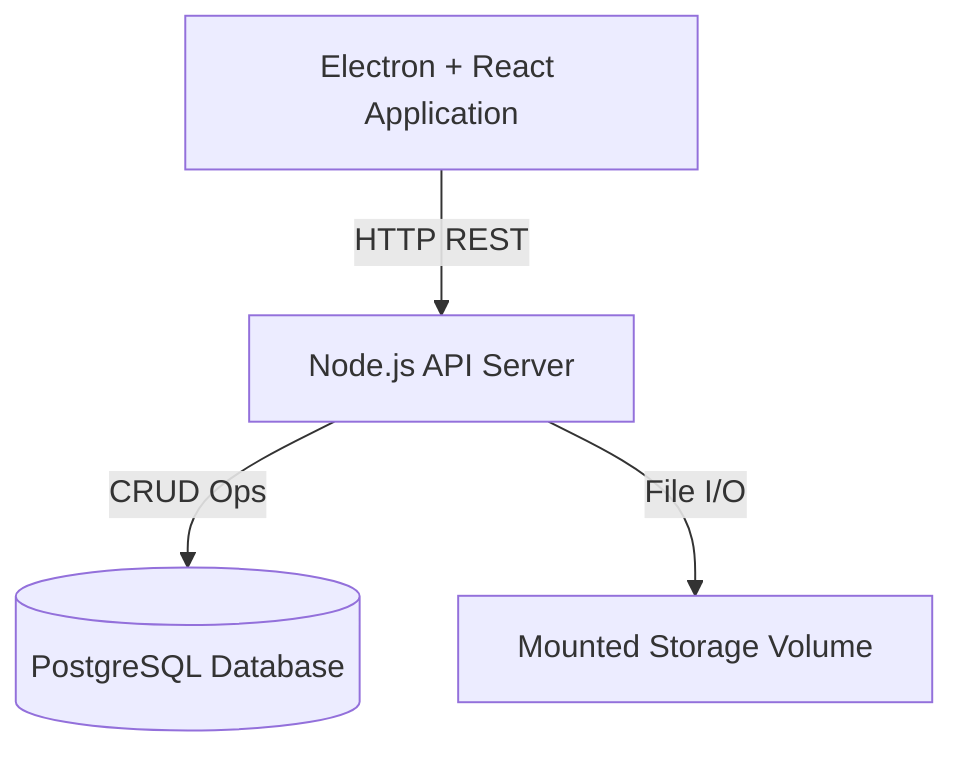

# Design Document – Voyis Electron Image Editor

## 1. Overview
This design document describes the system architecture, components, workflows, scalability considerations, and technology choices for building the **Voyis Electron-based Image Editor Tool**, based on the project specification for the Software Developer Project Brief (November 2025). The goal is to create a maintainable and scalable application that enables users to upload, view, and manage image data with server synchronization.

---

## 2. System Architecture

### 2.1 Architecture Diagram

### 2.2 Major Components

| Component | Responsibility |
|-----------|----------------|
| Electron Client | UI rendering, user interactions, file uploads, local state management |
| React UI | Rendering image gallery, controls, single-image view, sync panel |
| API Server | Handles image upload, metadata CRUD operations, sync requests |
| PostgreSQL | Stores metadata (e.g., filename, size, upload date, EXIF info) |
| Mounted Storage | Stores original images and derived thumbnails |

---

## 3. Data Flow

### 3.1 Upload Flow
1. User selects images in Electron UI
2. Files are streamed to API server via multipart upload
3. Server stores images in storage volume
4. Thumbnail generated using `sharp` and saved for gallery UI
5. Metadata stored in PostgreSQL

### 3.2 Viewing Workflow
- Gallery view loads thumbnails and metadata via API
- Single-image view loads full resolution image on demand
- Zoom, pan, and region selection handled via canvas-based UI component

---

## 4. Synchronization & Conflict Resolution
- Local state maintains a list of images, metadata, and sync status
- Server state queried during sync operations
- Conflict strategy: **Local Always Wins**
  - Rationale: Users' changes should take priority to enable a smooth workflow
  - Risk: Server-side changes may be overwritten silently

### 4.1 Potential Improvements
- Introduce versioning or revision history
- Prompt user to manually resolve conflicts when critical data mismatch is detected

---

## 5. Scalability Considerations

### 5.1 UI ✅ IMPLEMENTED
- **Virtualized rendering**: Implemented using `react-window` for large galleries
  - Automatically enabled when gallery has more than 50 images
  - Uses `FixedSizeGrid` for efficient rendering of image thumbnails
  - Only renders visible items, dramatically improving performance for 100+ images
  - Maintains all existing functionality (selection, filtering, double-click, etc.)
  - Falls back to standard grid rendering for smaller galleries (< 50 images)
- **Lazy-load images**: Images use `loading="lazy"` attribute for deferred loading

### 5.2 API & Database
- Use indexed queries for large metadata tables
- Split metadata and blob storage – allow switching to S3 or cloud storage
- Potential use of caching (Redis) for frequent fetches

### 5.3 Storage
- Support compression for older files
- Provide hooks to integrate with cloud storage solutions for large-scale use

---

## 6. Optional Enhancements

### 6.1 WASM-based Image Operations ✅ IMPLEMENTED
- **Implementation**: Uses `@squoosh/lib` for browser-compatible WASM image processing
- **Features**:
  - Client-side image optimization using WebAssembly
  - WebP/JPEG/PNG format conversion with quality control
  - Image resizing with multiple interpolation methods (Lanczos3, Mitchell, etc.)
  - Zero Node.js native dependencies - pure browser WASM
  - Automatic fallback to original image if WASM processing fails
- **Integration**: 
  - Toggleable WASM processing in Single-Image Viewer
  - Applied to cropped image export and upload operations
  - Optimizes images before upload to reduce server storage
- **Benefits**:
  - Faster performance compared to pure JavaScript canvas operations
  - Better compression ratios (especially with WebP format)
  - No Node.js version compatibility issues (runs entirely in browser)
  - Reduces bandwidth and storage requirements

### 6.2 Metadata Editing ✅ IMPLEMENTED
- Use `exifr` to extract and optionally edit EXIF metadata
- Sync metadata changes to PostgreSQL

---

## 7. Testing ✅ IMPLEMENTED
- **Jest + React Testing Library**: Implemented for UI component testing
  - Test setup configured with jsdom environment
  - Tests for `syncUtils` module covering all utility functions
  - Tests for `Gallery` component covering basic rendering and interactions
  - Mock setup for localStorage, fetch, and browser APIs
- **Supertest**: Configured for backend API tests
  - Test structure in place for API endpoint testing
  - Mock setup for Prisma, file system, and image processing libraries
- **Test Scripts**: Added to package.json
  - `npm test` - Run all tests
  - `npm run test:watch` - Watch mode for development
  - `npm run test:coverage` - Generate coverage reports
- **Coverage Threshold**: Set to 50% for branches, functions, lines, and statements

---

## 8. Deployment
- Development: Docker Compose for database + API
- Production: Electron packaged as installer using electron-builder
- API server can be deployed to any Node-compatible hosting environment

---

## 9. Future Features
- Authentication & user access control
- Offline-first capability with client-side SQLite and sync queue
- Full-text search for image metadata
- Multi-window support in Electron

---

## 10. Appendix
- Tech Stack rationale
- Possible UI Mockups (pending)
- Sample API routes (in API.md)
