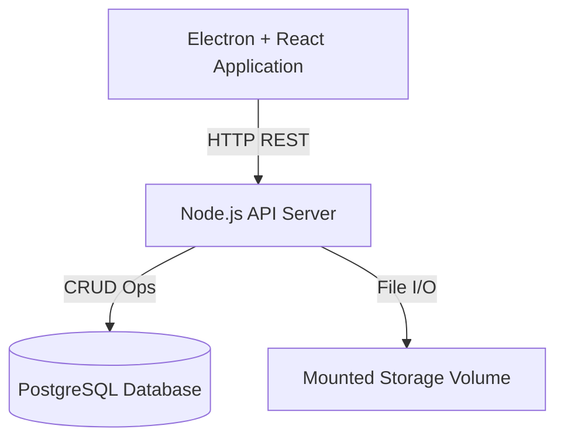
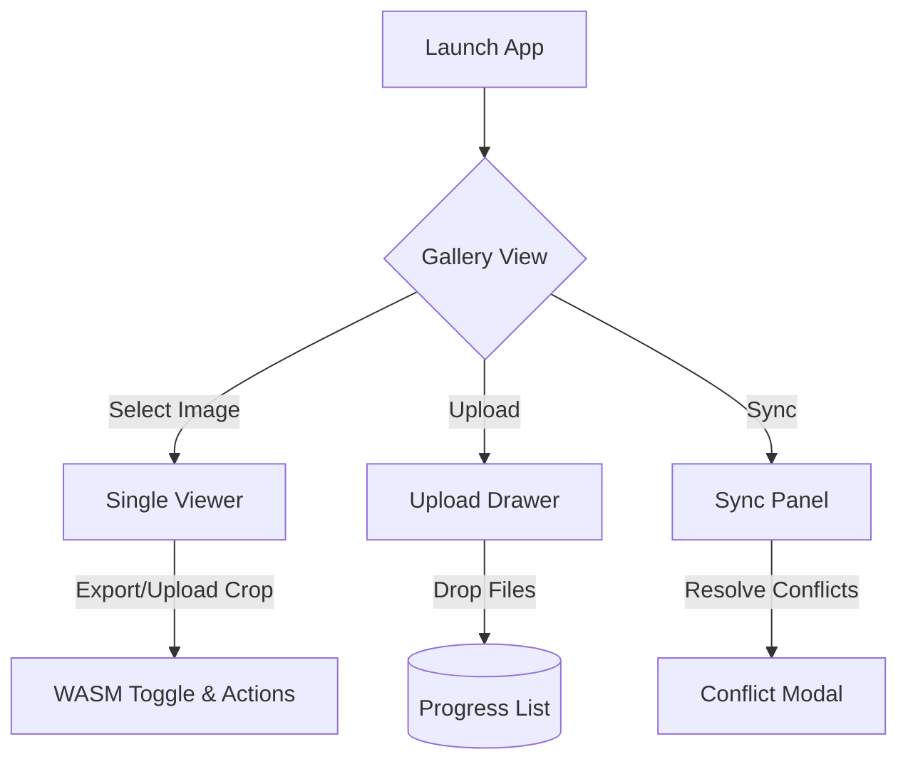
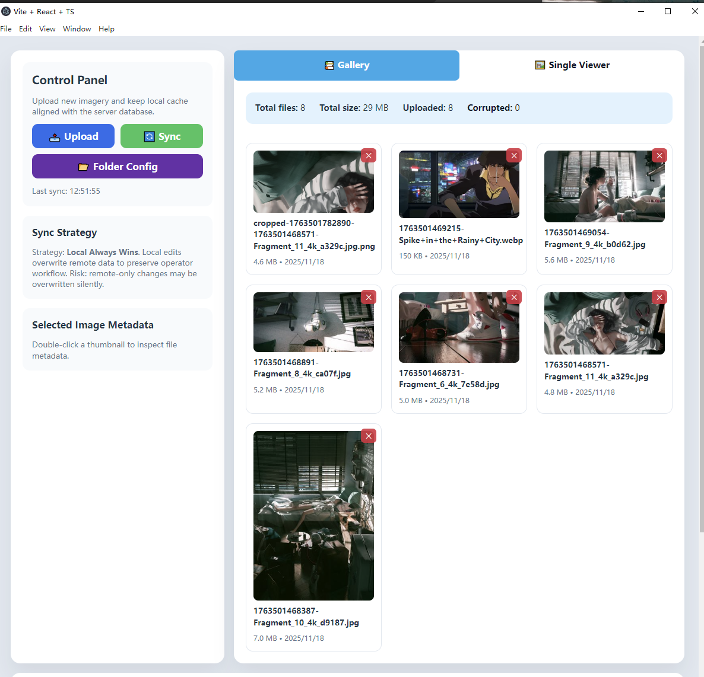
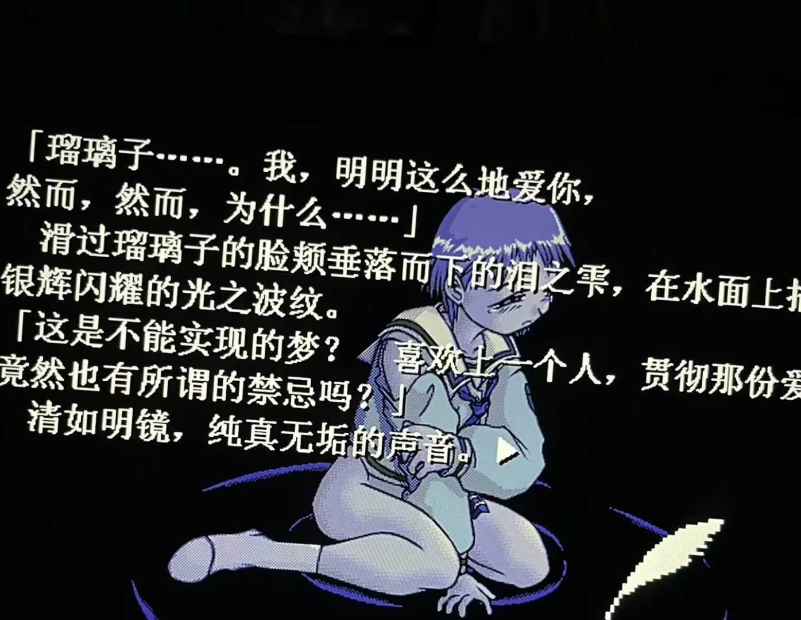
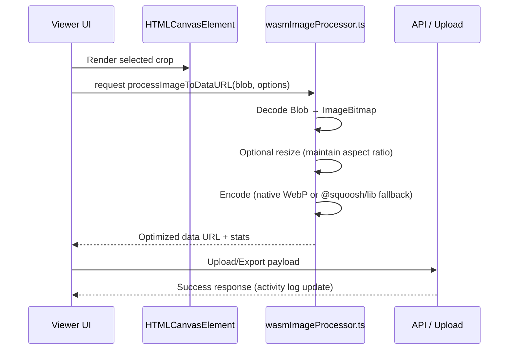

# Design Document – Voyis Electron Image Editor

## 1. Overview
This design document describes the system architecture, components, workflows, scalability considerations, and technology choices for building the **Voyis Electron-based Image Editor Tool**, based on the project specification for the Software Developer Project Brief (November 2025). The goal is to create a maintainable and scalable application that enables users to upload, view, and manage image data with server synchronization.

---

## 2. System Architecture

### 2.1 Architecture Diagram



### 2.2 Major Components

| Component | Responsibility |
|-----------|----------------|
| Electron Client | UI rendering, user interactions, file uploads, local state management |
| React UI | Rendering image gallery, controls, single-image view, sync panel |
| API Server | Handles image upload, metadata CRUD operations, sync requests |
| PostgreSQL | Stores metadata (e.g., filename, size, upload date, EXIF info) |
| Mounted Storage | Stores original images and derived thumbnails |

---

## 3. Data Flow

### 3.1 Upload Flow
1. User selects images in Electron UI
2. Files are streamed to API server via multipart upload
3. Server stores images in storage volume
4. Thumbnail generated using `sharp` and saved for gallery UI
5. Metadata stored in PostgreSQL

### 3.2 Viewing Workflow
- Gallery view loads thumbnails and metadata via API
- Single-image view loads full resolution image on demand
- Zoom, pan, and region selection handled via canvas-based UI component

---

## 4. Synchronization & Conflict Resolution
- Local state maintains a list of images, metadata, and sync status
- Server state queried during sync operations
- Conflict strategy: **Local Always Wins**
  - Rationale: Users' changes should take priority to enable a smooth workflow
  - Risk: Server-side changes may be overwritten silently

### 4.1 Potential Improvements
- Introduce versioning or revision history
- Prompt user to manually resolve conflicts when critical data mismatch is detected
- Diffing strategy for large batches:
  - Break sync payloads into chunks ( ≈200 entries) to cap memory usage per request.
  - Build hashed lookup tables / bloom filters client-side to quickly detect removals before requesting full metadata.
  - Support server-side “since lastSync” queries to return incremental deltas instead of full table scans.
  - Maintain a conflict queue so the UI can stream conflicts gradually, preventing freezes when thousands of items diverge.
- Conflict handling detail:
  - Every image record carries `updatedAt` + `revision`. When server detects `serverUpdatedAt > localLastModified`, entry is staged as potential conflict.
  - UI presents side-by-side comparison (server vs local), along with actions: **Keep Local** (default) or **Apply Server**.
  - Choosing “Apply Server” triggers PATCH back to local cache + activity log entry, ensuring user decisions are auditable.
  - Even when "Local Always Wins" auto-resolves, the system still records conflicts in the activity log and can export a CSV for audit trails.

---

## 5. UI / UX Blueprint

### 5.1 Wireframes



| Screen | Key Regions | Notes |
|--------|-------------|-------|
| Gallery | Control panel (upload/sync/folder config), filters, virtualized grid, activity log | Desktop-first layout with responsive breakpoint ≥ 1280px |
| Single Viewer | Toolbar (WASM toggle, export/upload buttons), canvas area, EXIF sidebar | Supports keyboard shortcuts (←/→ to change selection) |
| Upload Drawer | Drop zone, queued files with progress, error badges | Stays docked on right, non-blocking |
| Sync Panel | Status summary, pending/conflict lists, CTA buttons | Presents conflict cards with compare action |

### 5.1.1 Production UI Snapshot

Actual gallery UI (Electron renderer) implements the above blueprint with the following visual hierarchy (see `docs/screenshots/gallery.png`):



- **Left rail**: Control panel cards for Upload/Sync/Folder Config, Sync Strategy reminder (“Local Always Wins”), filter pills, batch actions, EXIF placeholder, Activity Log.
- **Center content**: Tabbed view (`Gallery` / `Single Viewer`). Gallery shows virtualized cards (thumbnail, filename, size, MIME) with corner delete buttons; activity log at bottom streams operations (fetch, delete, sync) with timestamps.
- **Color cues**: Primary blue for actions, green for sync success, red for destructive operations, matching design tokens described in UI spec.

Activity log close-up: 



### 5.2 User Journey

1. **Startup** → Gallery preloads cached thumbnails and shows loading skeletons while remote data is fetched.
2. **Filtering** → Filter pills toggle active states; the virtualized grid re-renders instantly.
3. **Uploading** → Upload drawer slides in; user drags files.
   - Each row displays thumbnail, size, and status pill (Uploading / Success / Failed).
   - Summary card shows completed / remaining counts and total bytes.
4. **Single Viewer** → Double-click opens HD preview + EXIF sidebar; toolbar exposes WASM toggle with tooltip explaining benefits.
5. **Crop / Export** → Action buttons trigger WASM pipeline; inline progress toast appears, followed by success/failure notification.
6. **Sync** → Control panel CTA shows last-sync timestamp; while running, button turns into spinner + “Syncing…”. Conflicts trigger a modal comparing server vs local versions.

### 5.3 Feedback & Skeleton States

| Scenario | Loading Skeleton | Success Prompt | Error Prompt |
|----------|------------------|----------------|--------------|
| Gallery initial load | Card placeholders (gray blocks with shimmer), log list shows phantom rows | Top toast “Loaded N images” | Red toast “Failed to fetch images” + Retry link |
| Upload drawer | Each file row starts as gray bar with progress from 0% | Inline green `✓ Uploaded` + “Open in viewer” link | Inline red `✗ Failed` with “Retry” button |
| Viewer WASM actions | Thin progress bar above canvas + label “Optimizing…” | Toast “Exported as WebP (45% smaller)” | Red toast “WASM failed, reverted to PNG” |
| Sync | Control panel button shows spinner + “Syncing…” | Log adds green entry “Server synced (added X, removed Y)” | Button reverts + warning banner suggesting retry |

---

## 5. Scalability Considerations

### 5.1 UI
- **Virtualized rendering**: Implemented using `react-window` for large galleries
  - Automatically enabled when gallery has more than 50 images
  - Uses `FixedSizeGrid` for efficient rendering of image thumbnails
  - Only renders visible items, dramatically improving performance for 100+ images
  - Maintains all existing functionality (selection, filtering, double-click, etc.)
  - Falls back to standard grid rendering for smaller galleries (< 50 images)
- **Lazy-load images**: Images use `loading="lazy"` attribute for deferred loading
- **Viewer tiling pipeline (planned)**:
  - Preprocess large images into 256×256 tiles via `sharp` during upload/export.
  - Viewer requests tiles based on zoom level + viewport, avoiding full-resolution decode.
  - Maintain in-memory tile cache with LRU eviction; stale tiles flushed when zoom level changes.
  - Allows smooth pan/zoom for multi-megapixel imagery while keeping memory usage bounded.

### 5.2 API & Database
- Use indexed queries for large metadata tables
- Split metadata and blob storage – allow switching to S3 or cloud storage
- Potential use of caching (Redis) for frequent fetches

### 5.3 Storage
- Support compression for older files
- Provide hooks to integrate with cloud storage solutions for large-scale use
- Streaming ingestion:
  - Leverage chunked uploads (multipart + resumable protocol) so Electron client can send large files without loading them fully in memory.
  - API writes directly to disk/remote storage via streams, enabling progress reporting and resumability.
  - Downstream processing (thumbnail, WASM optimization) can operate on streams/pipes instead of temporary files for lower I/O overhead.

---

## 6. Optional Enhancements

### 6.1 WASM-based Image Operations
- **Implementation**: Uses `@squoosh/lib` for browser-compatible WASM image processing
- **Features**:
  - Client-side image optimization using WebAssembly
  - WebP/JPEG/PNG format conversion with quality control
  - Image resizing with multiple interpolation methods (Lanczos3, Mitchell, etc.)
  - Zero Node.js native dependencies - pure browser WASM
  - Automatic fallback to original image if WASM processing fails
- **Integration**: 
  - Toggleable WASM processing in Single-Image Viewer
  - Applied to cropped image export and upload operations
  - Optimizes images before upload to reduce server storage
- **Benefits**:
  - Faster performance compared to pure JavaScript canvas operations
  - Better compression ratios (especially with WebP format)
  - No Node.js version compatibility issues (runs entirely in browser)
  - Reduces bandwidth and storage requirements

#### WASM Pipeline (Implementation Detail)



Invocation in code:

```ts
const { processImageToDataURL } = await import('./wasmImageProcessor');
const processed = await processImageToDataURL(blob, {
  format: useWASM ? 'webp' : 'png',
  quality: 85,
  resize: viewerResizeOptions,
});
```

If native WebP path fails (e.g., canvas context unavailable), processor falls back to `@squoosh/lib`’s ImagePool to perform `mozjpeg`/`oxipng` encoding before handing the optimized buffer back to the viewer or upload pipeline.

### 6.2 Metadata Editing 
- Use `exifr` to extract and optionally edit EXIF metadata
- Sync metadata changes to PostgreSQL

---

## 7. Testing 
- **Jest + React Testing Library**: Implemented for UI component testing
  - Test setup configured with jsdom environment
  - Tests for `syncUtils` module covering all utility functions
  - Tests for `Gallery` component covering basic rendering and interactions
  - Mock setup for localStorage, fetch, and browser APIs
- **Supertest**: Configured for backend API tests
  - Test structure in place for API endpoint testing
  - Mock setup for Prisma, file system, and image processing libraries
- **Test Scripts**: Added to package.json
  - `npm test` - Run all tests
  - `npm run test:watch` - Watch mode for development
  - `npm run test:coverage` - Generate coverage reports
- **Coverage Threshold**: Set to 50% for branches, functions, lines, and statements

---

## 8. Deployment
- Development: Docker Compose for database + API
- Production: Electron packaged as installer using electron-builder
- API server can be deployed to any Node-compatible hosting environment

---

## 9. Future Features
- Authentication & user access control
- Offline-first capability with client-side SQLite and sync queue
- Full-text search for image metadata
- Multi-window support in Electron
- Folder Config JSON improvements:
  - **Corruption detection**: Validate JSON against schema (Ajv) before persisting; include checksum/hash to detect tampering, and keep last-known-good snapshot for quick rollback.
  - **Fault tolerance**: When batch-importing configs, wrap each entry in a transactional guard—skip invalid folders, write errors to the activity log, and offer a “re-import failed items” CTA so a single corrupt record will not block the overall import.

---

## 10. Appendix
- Tech Stack rationale
- Possible UI Mockups (pending)
- Sample API routes (in API.md)
